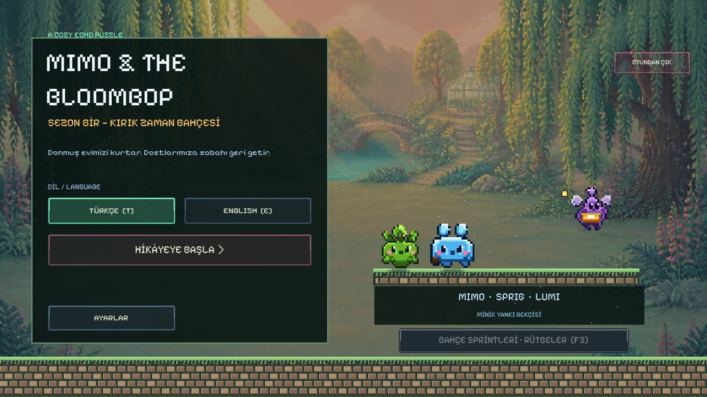
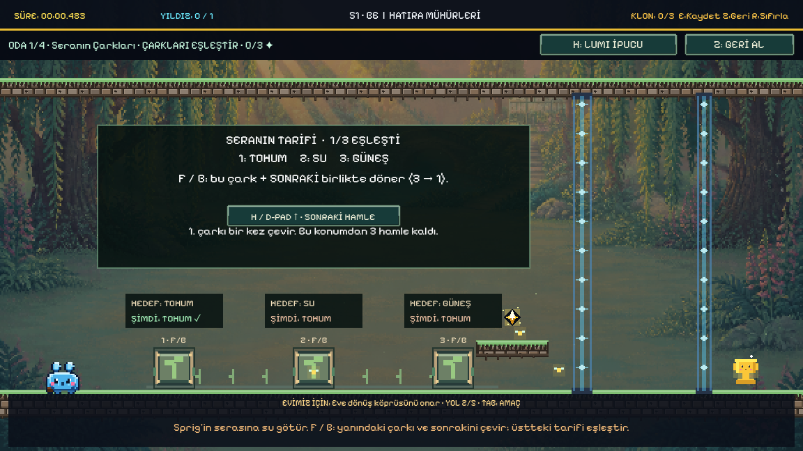
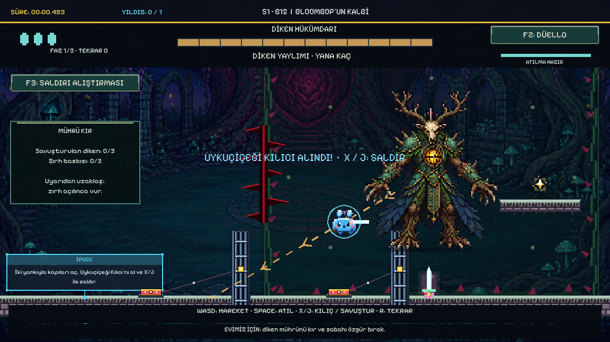

# Mimo & the Bloombop

### Geçmişinle yol aç. Bahçeye sabahı geri getir.

**Windows · Tek oyunculu · Türkçe / English · Klavye ve oyun kumandası**

Mimo'nun hareketlerini kaydet; yankıların anahtarları ve asansörleri çalıştırırken yeni yollar aç. Sprig'in serasına suyu geri getir, unutulan hatıraları bul ve Diken Hükümdarı'nın mührünü kır.

## İndir ve oyna

**[Oyun ZIP'ini indir](../../releases/latest/download/Mimo-and-the-Bloombop-Windows.zip)** · **[Tüm yayınlar](../../releases)** · **[Tanıtım videosu — MP4](../../releases/latest/download/Mimo-Showcase.mp4)**

1. `Mimo-and-the-Bloombop-Windows.zip` dosyasını indir.
2. ZIP'in tamamını bir klasöre çıkart.
3. `Mimo-and-the-Bloombop.exe` dosyasını çalıştır. Godot kurman gerekmez.
4. Ana menüden dili seç; **Hikâyeye Başla** öğreticiyi açar.

GitHub'ın otomatik oluşturduğu **Source code (zip)** indirmesi oyun değildir. Yukarıdaki oyun ZIP'ini kullan.

Dağıtım dijital olarak imzalı değildir. Windows uyarı gösterebilir; güvenlik yazılımını kapatma. Dosyanın kaynağını ve yayındaki `SHA256SUMS.txt` sağlama toplamını kontrol et. Dosya engellenirse hata bildir.

## Seni neler bekliyor?

- **Birlikte çalışan yankılar:** kayıtlı hareketlerin düğmeleri ve şalterleri yeniden çalıştırır.
- **Değişen bahçeler:** asansör, mantar, yerçekimi, anahtar ve sera bulmacaları.
- **Bir amaç:** Mimo, Sprig ve Lumi ile donmuş evinize sabahı geri getirmek.
- **Diken Hükümdarı:** üç fazlı dövüş, beş saldırı deseni, kılıç, savuşturma ve atılma.
- **Kendi hızını seç:** hikâye yolculuğu, isteğe bağlı hatıralar ve açılan bölümlerde hız koşuları.
- **Erişilebilirlik:** azaltılmış hareket, yankı kontrastı ve ayrı ses ayarları.

### Oyun içinden

**[37 saniyelik oynanış videosunu izle/indir](../../releases/latest/download/Mimo-Showcase.mp4)** — oyun sesleriyle kaydedilmiş ve kurgulanmış görüntüler; finalden kesit içerir. Kayıtta karakter otomatik girişlerle yönetilmiştir; boss hasarı ve mekanikler oyunun kendi sistemleridir.

## Kontroller

| İşlem | Klavye |
| --- | --- |
| Hareket | A/D veya yön tuşları |
| Zıplama | Space |
| Yankı kaydetme | E |
| Yakındaki şalter / çark | F |
| Bağlamsal ipucu | H |
| Bölümü yeniden deneme | R |
| Duraklatma | Esc |
| Boss: kılıç / savuşturma | X veya J |
| Boss: atılma | Space |
| Boss: alıştırma / desen seçimi | F3 / F4 |

Kumanda kontrolleri oyun içinde gösterilir. Boss alıştırması hikâyeyi tamamlamaz; rahat boss modu hız koşusunda yardımlı olarak işaretlenir.

## Uyumluluk ve kayıt

Windows x64 sürümüdür. Vulkan destekli ekran kartı/sürücü gerekir. Test bilgisayarında NVIDIA RTX 2060 SUPER kullanılmıştır; bu bir minimum sistem gereksinimi iddiası değildir. Diğer donanımlarda performans garantisi verilmez.

İlerleme ve ayarlar yerel olarak `%APPDATA%\Godot\app_userdata\Mimo & the Bloombop` altında tutulur. Oyunu güncellerken bu klasörü silme. [Gizlilik](PRIVACY.md)

## Hata bildir

[Issues bölümünden](../../issues) bölüm/oda numarasını, sorunu tekrar oluşturma adımlarını, ekran görüntüsünü ve Windows/ekran kartı bilgilerini paylaş. Şifre, erişim anahtarı veya kişisel dosya gönderme.

15 ana bölüm rotası ve 42 ara oda yerleşimi otomatik fizik testlerinden geçti. Bu, her cihazda tüm hataların bulunmuş olduğu anlamına gelmez. [Bilinen durumlar](KNOWN_ISSUES.md)

## Açık kaynak değildir

Bu depo yalnızca **oyuncular için dağıtım ve tanıtım sayfasıdır**. Godot projesi, oyun betikleri ve düzenlenebilir varlıklar paylaşılmaz. Oyunun ücretsiz indirilebilmesi açık kaynak lisansı verildiği anlamına gelmez. [Kullanım bildirimi](COPYRIGHT.md) · [Katkılar ve üçüncü taraf lisansları](CREDITS.md)

---

## English

**Record your past. Open a new path. Bring morning home.**

Mimo & the Bloombop is a single-player pixel-art echo-puzzle adventure with a story, greenhouse puzzles, moving lifts, optional collectibles, speedrun routes and a three-phase boss encounter.

[Download the Windows game ZIP](../../releases/latest/download/Mimo-and-the-Bloombop-Windows.zip), extract it and launch `Mimo-and-the-Bloombop.exe`. Select **English** in the menu. No Godot installation is needed. The build is unsigned; keep your security software enabled and verify the published SHA-256 checksum.

This is a **binary distribution repository, not an open-source project**. GitHub's automatic “Source code” archives contain this showcase page, not the playable game. [Watch/download the gameplay showcase](../../releases/latest/download/Mimo-Showcase.mp4) (ending spoilers).
